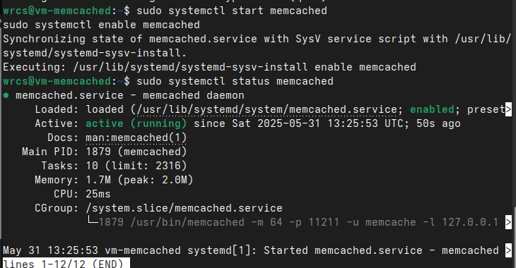
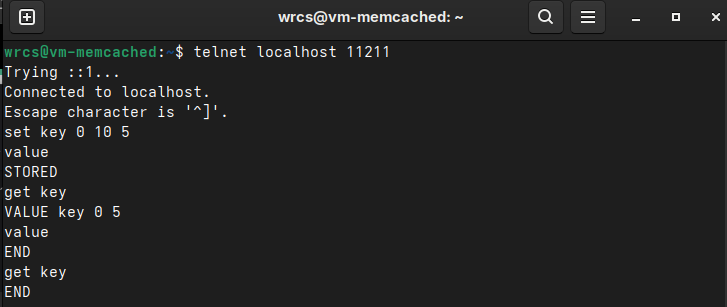
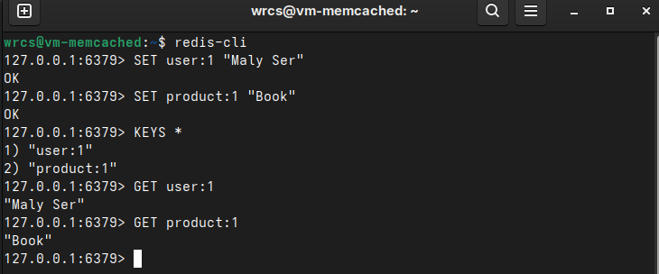

# Домашнее задание к занятию «Кеширование Redis/memcached» - Малявко Сергей (11-02)

### Задание 1. Кеширование

Приведите примеры проблем, которые может решить кеширование.
Приведите ответ в свободной форме.

#### Ответ к заданию 1.

Проблемы, которые решает кеширование (на примере Redis/memcached)
**Кеширование** — это мощный инструмент для оптимизации производительности и снижения нагрузки на систему. Вот ключевые проблемы, которые оно помогает решить:

1. Высокая нагрузка на базу данных
2. Медленные ответы API/веб-страниц
3. Проблемы с сессиями пользователей
4. Троттлинг и защита от DDoS
5. Синхронизация данных в распределённых системах
6. Кеширование статики и CDN-заменитель

Итог
Кеширование решает:
- Проблемы производительности (нагрузка на БД, медленные запросы).
- Задачи согласованности (сессии, блокировки, счетчики).
- Угрозы безопасности (троттлинг, защита от атак).

**Redis** лучше подходит для сложных сценариев (транзакции, pub/sub), **memcached** — для простого key-value с максимальной скоростью.

### Задание 2. Memcached

Установите и запустите memcached.
Приведите скриншот systemctl status memcached, где будет видно, что memcached запущен.

#### Ответ к заданию 2.
##### Скриншот результата блансировки Round-robin на 4 уровне:

### Задание 3. Удаление по TTL в Memcached

Запишите в memcached несколько ключей с любыми именами и значениями, для которых выставлен TTL 5.
Приведите скриншот, на котором видно, что спустя 5 секунд ключи удалились из базы.

#### Ответ к заданию 3.
(сделал 10 сек не успевал для 5 сек выполнить команды)

##### Скриншот результата спустя 10 секунд ключи удалились из базы:

### Задание 4. Запись данных в Redis

Запишите в Redis несколько ключей с любыми именами и значениями.
Через redis-cli достаньте все записанные ключи и значения из базы, приведите скриншот этой операции.

#### Ответ к заданию 4.

##### Скриншот результата вывода записанных ключей и значений из базы:

